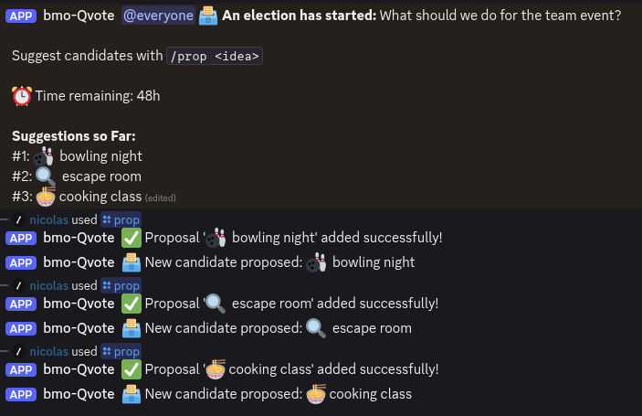
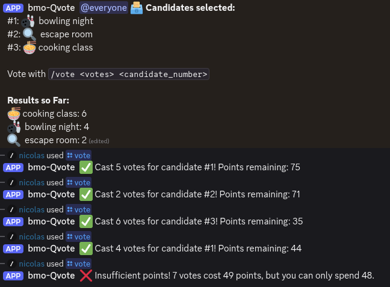
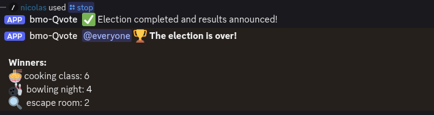

# 🗳️ Quadratic Voting Discord Bot

A Discord bot that implements quadratic voting for community decision-making, built in Rust for maximum performance!

🆕 **Modern Discord API**: Updated to use slash commands exclusively - fully compliant with Discord's 2025 requirements!

## ✨ What is Quadratic Voting?

Unlike regular voting (1 person = 1 vote), quadratic voting lets people express *how much* they care about different options by spending "voice credits":

- **1 vote** costs **1 credit**
- **2 votes** cost **4 credits** 
- **3 votes** cost **9 credits**
- **n votes** cost **n² credits**

This system reveals preference intensity while preventing any single person from dominating decisions!

## 🎮 How Elections Work

### Phase 1: Suggestions (Manual Duration)
- Users propose ideas: `/prop idea:pizza party`
- Ideas get collected and **numbered chronologically** in announcement channel
- No voting yet - pure brainstorming!
- **Admin must call `/stop`** to transition to voting phase

### Phase 2: Voting (Manual Duration)
- Proposals become numbered candidates (locked in)
- Each user gets **100 voice credits**
- Vote with: `/vote n:3 id:0` (spend 9 credits for 3 votes on candidate #0)
- Live results update automatically
- **Admin calls `/stop`** to end voting and show final results

### 🎯 Example Election Flow

1. **Admin starts election:**
   ```
   /start prompt:What should we do for the team event?
   ```

2. **Users suggest ideas (chronologically numbered):**
   ```
   /prop idea:bowling night        → Shows as #1
   /prop idea:escape room          → Shows as #2
   /prop idea:cooking class        → Shows as #3
   ```

   

3. **Admin transitions to voting phase:**
   ```
   /stop    # Locks in candidates and starts voting
   ```

4. **Users vote strategically:**
   ```
   /vote n:5 id:0    # Cast 5 votes for bowling, costs 25 credits
   /vote n:2 id:1    # Cast 2 votes for escape room, costs 4 credits
   /points           # Check remaining credits (71 left)
   ```

   

> note: it is possible to recast a vote, credits are not lost. 

1. **Admin ends election and shows results:**
   ```
   /stop    # Shows final winner and vote tallies
   ```

   

---

## 🤖 Modern Slash Commands

| Command | Description | Who Can Use | Response Type |
|---------|-------------|-------------|---------------|
| `/prop idea:<text>` | Suggest a candidate during proposal phase | Everyone | Public |
| `/vote n:<1-10> id:<number>` | Cast votes for candidate (costs n² credits) | Everyone | Public |
| `/points` | Check your remaining voice credits | Everyone | Private (ephemeral) |
| `/start prompt:<text>` | Begin a new election cycle | Admins* | Deferred (takes time) |
| `/stop` | Progress to next phase or end election | Admins* | Deferred (takes time) |

*Admins = Server Owner, Administrator permission, or "voting" role

### 🔒 Enhanced Security Features
- **Rate Limiting**: 2-second cooldown between commands per user
- **Input Validation**: Automatic validation of all parameters
- **Permission Tiers**: Server Owner > Administrator > Role-based access
- **Error Handling**: User-friendly error messages with helpful feedback

## 📚 Documentation

- **[🛠️ Setup Guide](SETUP.md)** - Discord configuration and deployment
- **[🧠 Voting Logic](LOGIC.md)** - Governance model and democratic mechanics

## 🚀 Getting Started

Ready to set up your own quadratic voting bot? Check out our [**📋 Setup Guide**](SETUP.md) for complete instructions on:

- Discord bot configuration
- Server setup requirements  
- Deployment with Docker
- Using the BMO helper scripts

**Quick start:** `./bmo-build.sh run` (after following setup guide)

## ⚙️ Technical Details

- **Language:** Rust with modern Serenity 0.12 Discord library
- **Discord API:** Fully compliant with 2025 slash command requirements
- **Storage:** In-memory (Vec/HashMap) - chronological ordering, resets on restart
- **Architecture:** Modern async/await with tokio runtime
- **Election Flow:** Manual progression via admin `/stop` commands (no automatic timers)
- **Security:** Multi-tier permissions, rate limiting, input validation
- **UX:** Smart response patterns (immediate, ephemeral, deferred)

## 🔜 Potential Enhancements

- [ ] Persistent database storage
- [ ] Web dashboard for results visualization  
- [ ] Multiple concurrent elections [#3](https://github.com/nicolasdb/qvoting-bot/issues/3)
- [ ] Configurable time intervals [#2](https://github.com/nicolasdb/qvoting-bot/issues/2)
- [ ] Audit logs and vote history

---

*Built with mathematical precision by BMO! (◕‿◕✿)*
